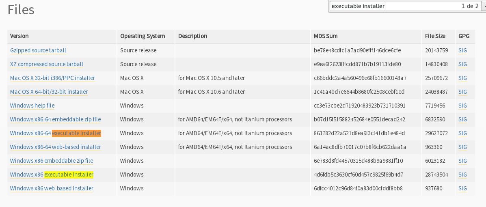

# Preparando o ambiente de trabalho
Para iniciarmos nossos estudos, será necessário instalar o Python. Neste tutorial iremos utilizar a versão 3 da linguagem, o Python 3. Existem algumas diferenças entre o Python 2 e o Python 3, por isso, mesmo que você já possua uma versão do Python 2 instalada na sua máquina, recomendamos fortemente que você instale o Python 3.

## Instalando Python
Dependendo do seu sistema operacional, o Python pode ser obtido de diversas maneiras. Nesta parte do guia vamos aprender à instalar o Python em diversos sistemas operacionais.

### Windows
Para instalar o Python no Windows, é preciso que você faça o download da última versão disponível no site do Python Software Foundation, clicando [aqui](https://www.python.org/downloads/windows/). Procure por um link onde estará indicando a última versão do Python 3, algo como _Latest Python 3 Release_. Você será redirecinada para uma página com um resumo das últimas novidades da linguagem e ao final, com os links para download. Faça o download do arquivo de instalação de acordo com o seu sistema operacional: se você utiliza um Windows 64 bits, procure por _Windows x86-64 executable installer_, ou para versões 32 bits do Windows, _Windows x86 executable installer_.


## Linux
Se você for uma usuária Linux, provavelmente já possui o Python instalado pois ele faz parte do conjunto de aplicações básicas da maioria das distribuições Linux. Para verificar, basta abrir o terminal e digitar
```sh
whereis python
```

